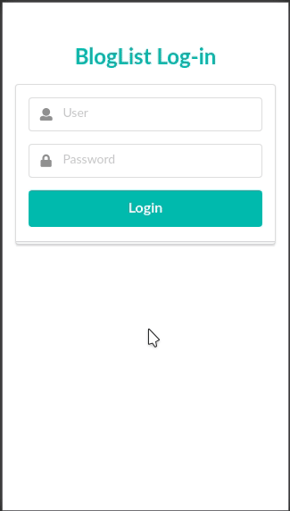

# BlogList Frontend
A React based application, using tools like:
- Redux for state management 
- React-router for the route management
- SemanticUI styled components
- Responsive UI (mobile and desktop layouts)



* The BlogList Backend application is required.

## Running in console
Set the backend url manually or in the `.env` file. Assuming the backend service is running locally, the `.env` file should contain:
```
REACT_APP_BACKEND_URL='http://localhost:3001'
```
Then, run the application in development mode with:
```console
$ npm install
$ npm start
```
Check the code lint with:
```
$ npm run eslint
```

## Running as a docker container
* The application is production-builded and served using nginx.

Set the backend url manually or in the `.env.container` file. Then, build the container with:
```console
$ docker build . -t bloglist-frontend
```
An `.env.container` file is required, but be aware the project code should be able to reach the backend service from within the container. Assuming the backend service is runnig in localhost port 3001, the `REACT_APP_BACKEND_URL` field would look as:
```
REACT_APP_BACKEND_URL='http://host.docker.internal:3001'
```
And you'll run the container with:
```console
$ docker run -it -p 80:80 --name bloglist-frontend --rm \
    --add-host=host.docker.internal:host-gateway \
    --env-file .env.container \
    bloglist-frontend
```
